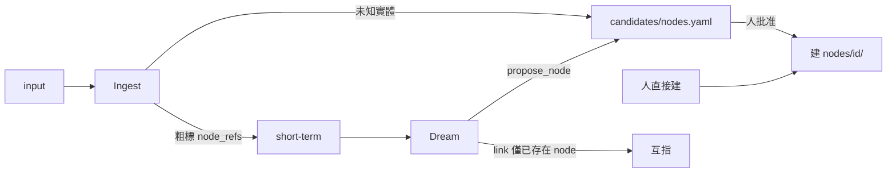

# Node Graph（建立、重組、收斂）

← [INDEX](../INDEX.md) · [nodes](./nodes.md)

## 什麼時候該有獨立 node？

Node = 值得長期維護 **一組 understand + chronology** 的實體或主題。

| 信號 | 說明 |
|------|------|
| **可指稱** | 穩定名字或 alias |
| **重複出現** | 如 ≥3 次 / 7 天作為 primary |
| **語意內聚** | what/who/problems 可寫在一起 |
| **持續關聯** | 之後還會再提起 |
| **與現有 node 不可合** | 非純 alias |

**不建：** 一次性提及、已是 alias、純形容、僅 mention 的從屬資訊。

## 建立流程（已定案）

> **Dream 永不直接建 `nodes/{id}/`。**  
> 只寫 `candidates/nodes.yaml`；**人批准後**才建立正式 node。



| 階段 | 做什麼 |
|------|--------|
| **Ingest** | 已知 node → short-term；未知 → 可粗記進 candidates，**不建目錄** |
| **Dream** | 達標 → `propose_node` patch → append / upsert `candidates/nodes.yaml` |
| **批准** | 人審核 candidates → 建 `nodes/{id}/` 最小骨架；可改 id / 併入既有 alias |
| **拒絕** | 標 `rejected` 或改 alias 指向既有 node；不留孤兒目錄 |

**落點：**

```
candidates/
├── nodes.yaml           # 待建 node（本節）
└── attribution.yaml     # 低置信 primary/mention → nodes-chronology.md
```

```yaml
# candidates/nodes.yaml（草案）
- proposed_id: acme-compliance
  kind: topic
  aliases: ["合規", "compliance"]
  reason: "連續 4 天作為 primary 討論"
  evidence_event_refs: [e041, e042, e055]
  proposed_at: "2026-07-18"
  dream_run_id: "dream-2026-07-18"
  status: pending   # pending | approved | rejected | aliased
```

`propose_node` 經 L0.5 patch log 再寫入 candidates（見 [dream.md](./dream.md)）。

**最小骨架（批准後才建）：** `node.meta.yaml`、`INDEX.md`、`understand/`、`chronology/INDEX.md` + `recent.md`

## 重組（T1–T4）

用 **圖（link / net）** 表達關係，不用 rigid parent/children。

| 類型 | 名稱 | 原 node | 結果 | 例子 |
|------|------|---------|------|------|
| **T1** | 展開 expand | 保留 | **1 + N** | `fruit` → `fruit` + `apple` + `orange` |
| **T2** | 重定義 reframe | 被新 parent 取代 | **P + N** | `sales-ops` → `commerce` + `retail`/`wholesale`/`marketplace` |
| **T3** | 解散 dissolve | 不保留 | **N**（宜 ≤3） | 一個 node 其實是 2–3 個東西 |
| **T4** | 對齊 expand-align | 變種 | 部分併入 **已存在** node | 拆出 `acme` 併入現有 `nodes/acme` |

**T1：** 原 node 仍是那個概念。**T2：** 原 node 升級/改名成更準的 umbrella。

### 共同步驟（`restructure`）

1. 分析 understand + chronology + event_refs
2. 建/選 node（T4 對齊現存）
3. 遷移 facet、chronology；附 `migrated_from` / `event_refs`
4. 寫圖邊 + 各 node 內 **grouping 描述**（自然語言）
5. 原 node：保留（T1）/ redirect（T2）/ archive（T3）
6. L0 不刪；更新 `node_ref_aliases`

### Grouping 描述範例

```markdown
與 [[fruit]]、[[orange]] 同屬「水果」概念叢；fruit 為概括層。
```

## 節點圖（link / net）

```yaml
# graph/links.yaml
edges:
  - from: apple
    to: fruit
    type: group
  - from: sales-ops
    to: commerce
    type: supersedes
  - from: acme
    to: retail
    type: related
    strength: 0.8
```

| 邊類型 | 意義 |
|--------|------|
| `group` | 概念叢（可多對多） |
| `related` | 一般關聯 |
| `supersedes` | T2 舊 → 新 |
| `merged_into` | 重複合併指向 canonical |
| `alias` | 同一實體不同名 |

## 收斂（convergence）

相近 node **預設不融合**：

| 策略 | 何時 |
|------|------|
| **Strengthen link**（預設） | 常一起想起 → `strength` ↑，hot path |
| **Merge**（少數） | 確認同一實體、建重了 |
| **Alias** | 純命名重複 |

## Primary vs mention

- **建 node** → 記憶住在哪
- **primary/mention** → event 寫多深

## 實作節奏

| Phase | 策略 |
|-------|------|
| **P0（已定）** | Dream → `candidates/nodes.yaml`；**人批准才建** `nodes/{id}/`；人也可直接建 |
| P1 | 批准 UX / CLI（list、approve、reject、alias-into） |
| P2 | T4 對齊已存在（仍經人批，不自動建） |
| P3 | `restructure` T1–T3；link strength 收斂 |

## Patch 類型（草案）

```yaml
# Dream 只提案，不建目錄
propose_node:
  proposed_id: acme
  kind: org
  aliases: ["Acme"]
  reason: "..."
  evidence_event_refs: [e042]
  seed_facets: { what: "..." }   # 批准後可作初始 what.md

# 人批准後由工具寫入（非 Dream 自動 apply）
approve_node:
  proposed_id: acme
  final_id: acme                  # 可改名

restructure:
  type: expand | reframe | dissolve | expand_align
  source: fruit
  keep_source: true
  create: [apple, orange]
  migrate: { ... }
  edges: [...]

strengthen_link:
  from: acme
  to: retail
  delta_strength: 0.1

merge_node:
  canonical: acme
  absorb: acme-duplicate
```

## 激活路由

- 事實寫在 **primary** 一次
- 其他 node：mention + link
- 高 `strength` 邊 → activation **favor routing**
